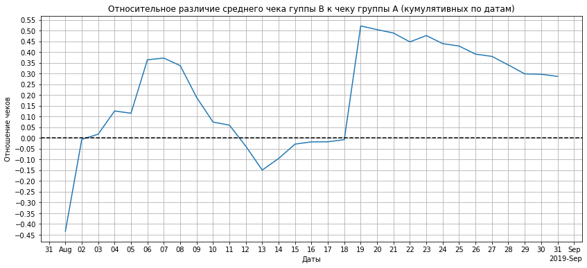

# Принятие решений в интернет-магазине по результатам A/B теста

## Основные положения

### Описание проекта

На начало выполнения проекта имеется список из 9 гипотез по увеличению выручки интернет-магазина. Для приоритизации гипотез необходмо применить фреймворки ICE и RICE. Далее необходимо проанализировать данные проведенного A/B теста, которые представлены в виде двух csv файлов. 

### Цель работы

Цель работы - приоритизировать гипотезы и проанализировать результат A/B-теста. 

### План выполнения работ

Последовательность выполнения работ:
- анализ кумулятивного изменения выручки, среднего чека и количества заказов на посетителя;
- определение аномальных данных;
- расчет статистической значимости различий анализируемых параметров по "сырым" данным;
- расчет статистической значимости различий анализируемых параметров по "очищенным" данным;
- принять решение по результатам теста;
- описать выводы.

## Выполнение работы


```python
import pandas as pd
import numpy as np
from IPython.display import display, HTML
import datetime as dt
import matplotlib.pyplot as plt
import matplotlib.dates as mdates
import scipy.stats as stats
```

### Часть 1. Приоритизация гипотез.

#### Подготовка данных


```python
h_data = pd.read_csv('/datasets/hypothesis.csv')
display(h_data.info())
HTML(h_data.to_html())
```

    <class 'pandas.core.frame.DataFrame'>
    RangeIndex: 9 entries, 0 to 8
    Data columns (total 5 columns):
     #   Column      Non-Null Count  Dtype 
    ---  ------      --------------  ----- 
     0   Hypothesis  9 non-null      object
     1   Reach       9 non-null      int64 
     2   Impact      9 non-null      int64 
     3   Confidence  9 non-null      int64 
     4   Efforts     9 non-null      int64 
    dtypes: int64(4), object(1)
    memory usage: 488.0+ bytes


    None


<table border="1" class="dataframe">
  <thead>
    <tr style="text-align: right;">
      <th></th>
      <th>Hypothesis</th>
      <th>Reach</th>
      <th>Impact</th>
      <th>Confidence</th>
      <th>Efforts</th>
    </tr>
  </thead>
  <tbody>
    <tr>
      <th>0</th>
      <td>Добавить два новых канала привлечения трафика, что позволит привлекать на 30% больше пользователей</td>
      <td>3</td>
      <td>10</td>
      <td>8</td>
      <td>6</td>
    </tr>
    <tr>
      <th>1</th>
      <td>Запустить собственную службу доставки, что сократит срок доставки заказов</td>
      <td>2</td>
      <td>5</td>
      <td>4</td>
      <td>10</td>
    </tr>
    <tr>
      <th>2</th>
      <td>Добавить блоки рекомендаций товаров на сайт интернет магазина, чтобы повысить конверсию и средний чек заказа</td>
      <td>8</td>
      <td>3</td>
      <td>7</td>
      <td>3</td>
    </tr>
    <tr>
      <th>3</th>
      <td>Изменить структура категорий, что увеличит конверсию, т.к. пользователи быстрее найдут нужный товар</td>
      <td>8</td>
      <td>3</td>
      <td>3</td>
      <td>8</td>
    </tr>
    <tr>
      <th>4</th>
      <td>Изменить цвет фона главной страницы, чтобы увеличить вовлеченность пользователей</td>
      <td>3</td>
      <td>1</td>
      <td>1</td>
      <td>1</td>
    </tr>
    <tr>
      <th>5</th>
      <td>Добавить страницу отзывов клиентов о магазине, что позволит увеличить количество заказов</td>
      <td>3</td>
      <td>2</td>
      <td>2</td>
      <td>3</td>
    </tr>
    <tr>
      <th>6</th>
      <td>Показать на главной странице баннеры с актуальными акциями и распродажами, чтобы увеличить конверсию</td>
      <td>5</td>
      <td>3</td>
      <td>8</td>
      <td>3</td>
    </tr>
    <tr>
      <th>7</th>
      <td>Добавить форму подписки на все основные страницы, чтобы собрать базу клиентов для email-рассылок</td>
      <td>10</td>
      <td>7</td>
      <td>8</td>
      <td>5</td>
    </tr>
    <tr>
      <th>8</th>
      <td>Запустить акцию, дающую скидку на товар в день рождения</td>
      <td>1</td>
      <td>9</td>
      <td>9</td>
      <td>5</td>
    </tr>
  </tbody>
</table>


Типы данных корректные. Названия колонок преобразуем в строчные.


```python
print(h_data.columns)
h_data.columns = h_data.columns.str.lower()
print(h_data.columns)
```

    Index(['Hypothesis', 'Reach', 'Impact', 'Confidence', 'Efforts'], dtype='object')
    Index(['hypothesis', 'reach', 'impact', 'confidence', 'efforts'], dtype='object')


#### Приоритизация по ICE

Расчет приоритетов по фреймфорку ICE производится по формуле:
$ICE\ SCORE = \frac{Impact * Confidence}{Efforts}$.

Добавим новый столбец с соответствующим приоритетом.


```python
h_data['ice'] = h_data['impact'] * h_data['confidence'] / h_data['efforts']
HTML(h_data.sort_values(by='ice', ascending = False).round({'ice':3}).to_html())
```


<table border="1" class="dataframe">
  <thead>
    <tr style="text-align: right;">
      <th></th>
      <th>hypothesis</th>
      <th>reach</th>
      <th>impact</th>
      <th>confidence</th>
      <th>efforts</th>
      <th>ice</th>
    </tr>
  </thead>
  <tbody>
    <tr>
      <th>8</th>
      <td>Запустить акцию, дающую скидку на товар в день рождения</td>
      <td>1</td>
      <td>9</td>
      <td>9</td>
      <td>5</td>
      <td>16.200</td>
    </tr>
    <tr>
      <th>0</th>
      <td>Добавить два новых канала привлечения трафика, что позволит привлекать на 30% больше пользователей</td>
      <td>3</td>
      <td>10</td>
      <td>8</td>
      <td>6</td>
      <td>13.333</td>
    </tr>
    <tr>
      <th>7</th>
      <td>Добавить форму подписки на все основные страницы, чтобы собрать базу клиентов для email-рассылок</td>
      <td>10</td>
      <td>7</td>
      <td>8</td>
      <td>5</td>
      <td>11.200</td>
    </tr>
    <tr>
      <th>6</th>
      <td>Показать на главной странице баннеры с актуальными акциями и распродажами, чтобы увеличить конверсию</td>
      <td>5</td>
      <td>3</td>
      <td>8</td>
      <td>3</td>
      <td>8.000</td>
    </tr>
    <tr>
      <th>2</th>
      <td>Добавить блоки рекомендаций товаров на сайт интернет магазина, чтобы повысить конверсию и средний чек заказа</td>
      <td>8</td>
      <td>3</td>
      <td>7</td>
      <td>3</td>
      <td>7.000</td>
    </tr>
    <tr>
      <th>1</th>
      <td>Запустить собственную службу доставки, что сократит срок доставки заказов</td>
      <td>2</td>
      <td>5</td>
      <td>4</td>
      <td>10</td>
      <td>2.000</td>
    </tr>
    <tr>
      <th>5</th>
      <td>Добавить страницу отзывов клиентов о магазине, что позволит увеличить количество заказов</td>
      <td>3</td>
      <td>2</td>
      <td>2</td>
      <td>3</td>
      <td>1.333</td>
    </tr>
    <tr>
      <th>3</th>
      <td>Изменить структура категорий, что увеличит конверсию, т.к. пользователи быстрее найдут нужный товар</td>
      <td>8</td>
      <td>3</td>
      <td>3</td>
      <td>8</td>
      <td>1.125</td>
    </tr>
    <tr>
      <th>4</th>
      <td>Изменить цвет фона главной страницы, чтобы увеличить вовлеченность пользователей</td>
      <td>3</td>
      <td>1</td>
      <td>1</td>
      <td>1</td>
      <td>1.000</td>
    </tr>
  </tbody>
</table>


Наибольший приоритет по фреймворку ICE получила гипотеза "Запустить акцию, дающую скидку на товар в день рождения".

#### Приоритизация по RICE

Расчет приоритетов по фреймфорку RICE производится по формуле:
$RICE\ SCORE = \frac{Reach * Impact * Confidence}{Efforts} = Reach * ICE\ SCORE$

То есть, фактически, мы добавляем учет охвата к предыдущему приоритету.
Добавим новый столбец с соответствующим приоритетом.


```python
h_data['rice'] = h_data['reach'] * h_data['ice']
HTML(h_data.sort_values(by='rice', ascending = False).round({'ice':3, 'rice':3}).to_html())
```


<table border="1" class="dataframe">
  <thead>
    <tr style="text-align: right;">
      <th></th>
      <th>hypothesis</th>
      <th>reach</th>
      <th>impact</th>
      <th>confidence</th>
      <th>efforts</th>
      <th>ice</th>
      <th>rice</th>
    </tr>
  </thead>
  <tbody>
    <tr>
      <th>7</th>
      <td>Добавить форму подписки на все основные страницы, чтобы собрать базу клиентов для email-рассылок</td>
      <td>10</td>
      <td>7</td>
      <td>8</td>
      <td>5</td>
      <td>11.200</td>
      <td>112.0</td>
    </tr>
    <tr>
      <th>2</th>
      <td>Добавить блоки рекомендаций товаров на сайт интернет магазина, чтобы повысить конверсию и средний чек заказа</td>
      <td>8</td>
      <td>3</td>
      <td>7</td>
      <td>3</td>
      <td>7.000</td>
      <td>56.0</td>
    </tr>
    <tr>
      <th>0</th>
      <td>Добавить два новых канала привлечения трафика, что позволит привлекать на 30% больше пользователей</td>
      <td>3</td>
      <td>10</td>
      <td>8</td>
      <td>6</td>
      <td>13.333</td>
      <td>40.0</td>
    </tr>
    <tr>
      <th>6</th>
      <td>Показать на главной странице баннеры с актуальными акциями и распродажами, чтобы увеличить конверсию</td>
      <td>5</td>
      <td>3</td>
      <td>8</td>
      <td>3</td>
      <td>8.000</td>
      <td>40.0</td>
    </tr>
    <tr>
      <th>8</th>
      <td>Запустить акцию, дающую скидку на товар в день рождения</td>
      <td>1</td>
      <td>9</td>
      <td>9</td>
      <td>5</td>
      <td>16.200</td>
      <td>16.2</td>
    </tr>
    <tr>
      <th>3</th>
      <td>Изменить структура категорий, что увеличит конверсию, т.к. пользователи быстрее найдут нужный товар</td>
      <td>8</td>
      <td>3</td>
      <td>3</td>
      <td>8</td>
      <td>1.125</td>
      <td>9.0</td>
    </tr>
    <tr>
      <th>1</th>
      <td>Запустить собственную службу доставки, что сократит срок доставки заказов</td>
      <td>2</td>
      <td>5</td>
      <td>4</td>
      <td>10</td>
      <td>2.000</td>
      <td>4.0</td>
    </tr>
    <tr>
      <th>5</th>
      <td>Добавить страницу отзывов клиентов о магазине, что позволит увеличить количество заказов</td>
      <td>3</td>
      <td>2</td>
      <td>2</td>
      <td>3</td>
      <td>1.333</td>
      <td>4.0</td>
    </tr>
    <tr>
      <th>4</th>
      <td>Изменить цвет фона главной страницы, чтобы увеличить вовлеченность пользователей</td>
      <td>3</td>
      <td>1</td>
      <td>1</td>
      <td>1</td>
      <td>1.000</td>
      <td>3.0</td>
    </tr>
  </tbody>
</table>


Наибольший приоритет по фреймворку RICE получила гипотеза "Добавить форму подписки на все основные страницы, чтобы собрать базу клиентов для email-рассылок".

#### Изменение приоритизации при смене фреймворка

В целом, состав ТОП5 приоритетов не изменился. Но значительно изменился их порядок ранжирования. Это произошло потому, что в случае RICE мы дополнительно учли охват воздействия гипотез. 

### Часть 2. Анализ A/B-теста

Получаем и проверяем данные результатов теста

#### Проверка данных по заказам


```python
orders = pd.read_csv('/datasets/orders.csv')
display(orders.info())
orders
```

    <class 'pandas.core.frame.DataFrame'>
    RangeIndex: 1197 entries, 0 to 1196
    Data columns (total 5 columns):
     #   Column         Non-Null Count  Dtype 
    ---  ------         --------------  ----- 
     0   transactionId  1197 non-null   int64 
     1   visitorId      1197 non-null   int64 
     2   date           1197 non-null   object
     3   revenue        1197 non-null   int64 
     4   group          1197 non-null   object
    dtypes: int64(3), object(2)
    memory usage: 46.9+ KB


    None


<div>
<style scoped>
    .dataframe tbody tr th:only-of-type {
        vertical-align: middle;
    }

    .dataframe tbody tr th {
        vertical-align: top;
    }

    .dataframe thead th {
        text-align: right;
    }
</style>
<table border="1" class="dataframe">
  <thead>
    <tr style="text-align: right;">
      <th></th>
      <th>transactionId</th>
      <th>visitorId</th>
      <th>date</th>
      <th>revenue</th>
      <th>group</th>
    </tr>
  </thead>
  <tbody>
    <tr>
      <th>0</th>
      <td>3667963787</td>
      <td>3312258926</td>
      <td>2019-08-15</td>
      <td>1650</td>
      <td>B</td>
    </tr>
    <tr>
      <th>1</th>
      <td>2804400009</td>
      <td>3642806036</td>
      <td>2019-08-15</td>
      <td>730</td>
      <td>B</td>
    </tr>
    <tr>
      <th>2</th>
      <td>2961555356</td>
      <td>4069496402</td>
      <td>2019-08-15</td>
      <td>400</td>
      <td>A</td>
    </tr>
    <tr>
      <th>3</th>
      <td>3797467345</td>
      <td>1196621759</td>
      <td>2019-08-15</td>
      <td>9759</td>
      <td>B</td>
    </tr>
    <tr>
      <th>4</th>
      <td>2282983706</td>
      <td>2322279887</td>
      <td>2019-08-15</td>
      <td>2308</td>
      <td>B</td>
    </tr>
    <tr>
      <th>...</th>
      <td>...</td>
      <td>...</td>
      <td>...</td>
      <td>...</td>
      <td>...</td>
    </tr>
    <tr>
      <th>1192</th>
      <td>2662137336</td>
      <td>3733762160</td>
      <td>2019-08-14</td>
      <td>6490</td>
      <td>B</td>
    </tr>
    <tr>
      <th>1193</th>
      <td>2203539145</td>
      <td>370388673</td>
      <td>2019-08-14</td>
      <td>3190</td>
      <td>A</td>
    </tr>
    <tr>
      <th>1194</th>
      <td>1807773912</td>
      <td>573423106</td>
      <td>2019-08-14</td>
      <td>10550</td>
      <td>A</td>
    </tr>
    <tr>
      <th>1195</th>
      <td>1947021204</td>
      <td>1614305549</td>
      <td>2019-08-14</td>
      <td>100</td>
      <td>A</td>
    </tr>
    <tr>
      <th>1196</th>
      <td>3936777065</td>
      <td>2108080724</td>
      <td>2019-08-15</td>
      <td>202740</td>
      <td>B</td>
    </tr>
  </tbody>
</table>
<p>1197 rows × 5 columns</p>
</div>


Делаем названия колонок более удобными для работы, изменяем тип данных колонки с датами.


```python
orders = orders.rename(columns = {'transactionId':'transaction_id', 'visitorId':'visitor_id'})
orders['date'] = orders['date'].map(
    lambda x: dt.datetime.strptime(x, '%Y-%m-%d')
)
orders.info()
```

    <class 'pandas.core.frame.DataFrame'>
    RangeIndex: 1197 entries, 0 to 1196
    Data columns (total 5 columns):
     #   Column          Non-Null Count  Dtype         
    ---  ------          --------------  -----         
     0   transaction_id  1197 non-null   int64         
     1   visitor_id      1197 non-null   int64         
     2   date            1197 non-null   datetime64[ns]
     3   revenue         1197 non-null   int64         
     4   group           1197 non-null   object        
    dtypes: datetime64[ns](1), int64(3), object(1)
    memory usage: 46.9+ KB


```python
orders
```


<div>
<style scoped>
    .dataframe tbody tr th:only-of-type {
        vertical-align: middle;
    }

    .dataframe tbody tr th {
        vertical-align: top;
    }

    .dataframe thead th {
        text-align: right;
    }
</style>
<table border="1" class="dataframe">
  <thead>
    <tr style="text-align: right;">
      <th></th>
      <th>transaction_id</th>
      <th>visitor_id</th>
      <th>date</th>
      <th>revenue</th>
      <th>group</th>
    </tr>
  </thead>
  <tbody>
    <tr>
      <th>0</th>
      <td>3667963787</td>
      <td>3312258926</td>
      <td>2019-08-15</td>
      <td>1650</td>
      <td>B</td>
    </tr>
    <tr>
      <th>1</th>
      <td>2804400009</td>
      <td>3642806036</td>
      <td>2019-08-15</td>
      <td>730</td>
      <td>B</td>
    </tr>
    <tr>
      <th>2</th>
      <td>2961555356</td>
      <td>4069496402</td>
      <td>2019-08-15</td>
      <td>400</td>
      <td>A</td>
    </tr>
    <tr>
      <th>3</th>
      <td>3797467345</td>
      <td>1196621759</td>
      <td>2019-08-15</td>
      <td>9759</td>
      <td>B</td>
    </tr>
    <tr>
      <th>4</th>
      <td>2282983706</td>
      <td>2322279887</td>
      <td>2019-08-15</td>
      <td>2308</td>
      <td>B</td>
    </tr>
    <tr>
      <th>...</th>
      <td>...</td>
      <td>...</td>
      <td>...</td>
      <td>...</td>
      <td>...</td>
    </tr>
    <tr>
      <th>1192</th>
      <td>2662137336</td>
      <td>3733762160</td>
      <td>2019-08-14</td>
      <td>6490</td>
      <td>B</td>
    </tr>
    <tr>
      <th>1193</th>
      <td>2203539145</td>
      <td>370388673</td>
      <td>2019-08-14</td>
      <td>3190</td>
      <td>A</td>
    </tr>
    <tr>
      <th>1194</th>
      <td>1807773912</td>
      <td>573423106</td>
      <td>2019-08-14</td>
      <td>10550</td>
      <td>A</td>
    </tr>
    <tr>
      <th>1195</th>
      <td>1947021204</td>
      <td>1614305549</td>
      <td>2019-08-14</td>
      <td>100</td>
      <td>A</td>
    </tr>
    <tr>
      <th>1196</th>
      <td>3936777065</td>
      <td>2108080724</td>
      <td>2019-08-15</td>
      <td>202740</td>
      <td>B</td>
    </tr>
  </tbody>
</table>
<p>1197 rows × 5 columns</p>
</div>


Проверяем состав данных.


```python
print('Полных дубликатов: {0}, \n "N/A":\n{1},\n\nуникальных значений: \n{2}\n Мин. выручка: {3}, макс. выручка: {4:_}'
      .format(
        orders.duplicated().sum(),
        orders.isna().sum(),
        orders.nunique(),
        orders['revenue'].min(),  
        orders['revenue'].max()
      )
)
```

    Полных дубликатов: 0, 
     "N/A":
    transaction_id    0
    visitor_id        0
    date              0
    revenue           0
    group             0
    dtype: int64,
    
    уникальных значений: 
    transaction_id    1197
    visitor_id        1031
    date                31
    revenue            713
    group                2
    dtype: int64
     Мин. выручка: 50, макс. выручка: 1_294_500


```python
print('Минимальная дата: {0:%Y-%m-%d}, максимальная дата: {1:%Y-%m-%d}'
      .format(orders['date'].min(), orders['date'].max()) )
print(orders['group'].value_counts())
```

    Минимальная дата: 2019-08-01, максимальная дата: 2019-08-31
    B    640
    A    557
    Name: group, dtype: int64


Проверяем пользователей, которые могли попасть в обе группы.
    Берем список заказов пользователей группы B, и оставляем в нем только записи тех пользователей, которые есть в группе A, затем оставляем только колонку ID пользователей и оставляем только уникальные. 


```python
dupl_vis_id = orders.query('group == "B"')[orders.query('group == "B"')['visitor_id']\
                                       .isin(orders.query('group == "A"')['visitor_id'])]\
                                        ['visitor_id'].unique()
print('Количество одинаковых пользователей в обоих группах:', len(dupl_vis_id))
```

    Количество одинаковых пользователей в обоих группах: 58


Удаляем записи с пользователями, попавшими в обе группы и проверяем наличие повторяющихся пользователей.


```python
orders = orders.loc[~orders['visitor_id'].isin(dupl_vis_id)]
#orders2.query('group == "B"')['visitor_id'].isin(orders2.query('group == "A"')['visitor_id']).sum()

dupl_vis_id = orders.query('group == "B"')[orders.query('group == "B"')['visitor_id']\
                                       .isin(orders.query('group == "A"')['visitor_id'])]\
                                        ['visitor_id'].unique()
print('Количество одинаковых пользователей в обоих группах:', len(dupl_vis_id))
```

    Количество одинаковых пользователей в обоих группах: 0


#### Проверка данных по посетителям


```python
visitors = pd.read_csv('/datasets/visitors.csv')
display(visitors.info())
visitors
```

    <class 'pandas.core.frame.DataFrame'>
    RangeIndex: 62 entries, 0 to 61
    Data columns (total 3 columns):
     #   Column    Non-Null Count  Dtype 
    ---  ------    --------------  ----- 
     0   date      62 non-null     object
     1   group     62 non-null     object
     2   visitors  62 non-null     int64 
    dtypes: int64(1), object(2)
    memory usage: 1.6+ KB


    None


<div>
<style scoped>
    .dataframe tbody tr th:only-of-type {
        vertical-align: middle;
    }

    .dataframe tbody tr th {
        vertical-align: top;
    }

    .dataframe thead th {
        text-align: right;
    }
</style>
<table border="1" class="dataframe">
  <thead>
    <tr style="text-align: right;">
      <th></th>
      <th>date</th>
      <th>group</th>
      <th>visitors</th>
    </tr>
  </thead>
  <tbody>
    <tr>
      <th>0</th>
      <td>2019-08-01</td>
      <td>A</td>
      <td>719</td>
    </tr>
    <tr>
      <th>1</th>
      <td>2019-08-02</td>
      <td>A</td>
      <td>619</td>
    </tr>
    <tr>
      <th>2</th>
      <td>2019-08-03</td>
      <td>A</td>
      <td>507</td>
    </tr>
    <tr>
      <th>3</th>
      <td>2019-08-04</td>
      <td>A</td>
      <td>717</td>
    </tr>
    <tr>
      <th>4</th>
      <td>2019-08-05</td>
      <td>A</td>
      <td>756</td>
    </tr>
    <tr>
      <th>...</th>
      <td>...</td>
      <td>...</td>
      <td>...</td>
    </tr>
    <tr>
      <th>57</th>
      <td>2019-08-27</td>
      <td>B</td>
      <td>720</td>
    </tr>
    <tr>
      <th>58</th>
      <td>2019-08-28</td>
      <td>B</td>
      <td>654</td>
    </tr>
    <tr>
      <th>59</th>
      <td>2019-08-29</td>
      <td>B</td>
      <td>531</td>
    </tr>
    <tr>
      <th>60</th>
      <td>2019-08-30</td>
      <td>B</td>
      <td>490</td>
    </tr>
    <tr>
      <th>61</th>
      <td>2019-08-31</td>
      <td>B</td>
      <td>718</td>
    </tr>
  </tbody>
</table>
<p>62 rows × 3 columns</p>
</div>


Изменяем тип данных колонки с датами.


```python
visitors['date'] = visitors['date'].map(
    lambda x: dt.datetime.strptime(x, '%Y-%m-%d')
)
visitors.info()
```

    <class 'pandas.core.frame.DataFrame'>
    RangeIndex: 62 entries, 0 to 61
    Data columns (total 3 columns):
     #   Column    Non-Null Count  Dtype         
    ---  ------    --------------  -----         
     0   date      62 non-null     datetime64[ns]
     1   group     62 non-null     object        
     2   visitors  62 non-null     int64         
    dtypes: datetime64[ns](1), int64(1), object(1)
    memory usage: 1.6+ KB


Проверяем состав данных.


```python
print('Полных дубликатов: {0}, \n "N/A":\n{1},\n\nуникальных значений: \n{2}\n Мин. выручка: {3}, макс. выручка: {4:_}'
      .format(
        visitors.duplicated().sum(),
        visitors.isna().sum(),
        visitors.nunique(),
        visitors['visitors'].min(),  
        visitors['visitors'].max()
      )
)
```

    Полных дубликатов: 0, 
     "N/A":
    date        0
    group       0
    visitors    0
    dtype: int64,
    
    уникальных значений: 
    date        31
    group        2
    visitors    58
    dtype: int64
     Мин. выручка: 361, макс. выручка: 770


```python
print('Минимальная дата: {0:%Y-%m-%d}, максимальная дата: {1:%Y-%m-%d}'
      .format(visitors['date'].min(), visitors['date'].max()) )
print(visitors['group'].value_counts())
```

    Минимальная дата: 2019-08-01, максимальная дата: 2019-08-31
    A    31
    B    31
    Name: group, dtype: int64


#### Задача 1. График кумулятивной выручки.

Формируем кумулятивные данные по дням по заказам.


```python
# создаем массив уникальных пар значений дат и групп теста
datesGroups = orders[['date','group']].drop_duplicates()

#агрегируем по заказам
ordersAggregated = datesGroups.apply(
    lambda x: orders[np.logical_and(orders['date'] <= x['date'], orders['group'] == x['group'])]
    .agg({'date' : 'max',
          'group' : 'max',
          'transaction_id' : 'nunique',
          'visitor_id' : 'nunique',
          'revenue' : 'sum'}),
    axis=1).sort_values(by=['date','group'])

#агрегированные кумулятивные по дням данные о посетителях
visitorsAggregated = datesGroups.apply(
    lambda x: visitors[np.logical_and(visitors['date'] <= x['date'], visitors['group'] == x['group'])]
    .agg({'date' : 'max', 'group' : 'max', 'visitors' : 'sum'}),
    axis=1).sort_values(by=['date','group'])

# объединяем кумулятивные данные в одной таблице и присваиваем ее столбцам новые названия
cumulativeData = ordersAggregated.merge(visitorsAggregated, left_on=['date', 'group'], right_on=['date', 'group'])
cumulativeData.columns = ['date', 'group', 'orders', 'buyers', 'revenue', 'visitors']

print(cumulativeData.head(5))
```

            date group  orders  buyers  revenue  visitors
    0 2019-08-01     A      23      19   142779       719
    1 2019-08-01     B      17      17    59758       713
    2 2019-08-02     A      42      36   234381      1338
    3 2019-08-02     B      40      39   221801      1294
    4 2019-08-03     A      66      60   346854      1845


Строим график кумулятивной выручки по датам по группам.


```python
# датафрейм с кумулятивным количеством заказов и кумулятивной выручкой по дням в группе А
cumulativeRevenueA = cumulativeData[cumulativeData['group']=='A'][['date','revenue', 'orders']]

# датафрейм с кумулятивным количеством заказов и кумулятивной выручкой по дням в группе B
cumulativeRevenueB = cumulativeData[cumulativeData['group']=='B'][['date','revenue', 'orders']]

fig = plt.figure(figsize = (14,6))

ax = fig.add_subplot(1, 1, 1)
ax.set_title('Кумулятивные выручки групп A и B')
ax.set_ylabel('Кумулятивная выручка, млн. руб.')
ax.set_xlabel('Даты')
ax.grid(True)
locator = mdates.DayLocator()
formatter = mdates.ConciseDateFormatter(locator)
ax.xaxis.set_major_locator(locator)
ax.xaxis.set_major_formatter(formatter)
yticks = np.arange(0, 6500000, 500000)
ax.set_yticks(yticks)

# Строим график выручки группы А
plt.plot(cumulativeRevenueA['date'], cumulativeRevenueA['revenue'], label='A')

# Строим график выручки группы B
plt.plot(cumulativeRevenueB['date'], cumulativeRevenueB['revenue'], label='B')

plt.legend();
```


    

    


<b>Вывод:</b>

Кумулятивная выручка постоянно растет по обеим группам. В целом, рост происходит схожими темпами, однако у группы B заметен сильный всплеск выучки 19.08.19. Это могло произойти либо изза необычного большого количества заказов в этот день, либо изза заказа с высоким чеком.

#### Задача 2. График кумулятивного среднего чека.

Размер среднего чека на дату считаем, как отношение кумулятивной выручки к кумулятивному числу заказов на эту дату. 


```python

fig = plt.figure(figsize = (14,6))

ax = fig.add_subplot(1, 1, 1)
ax.set_title('Кумулятивный средний чек за вемя теста')
ax.set_ylabel('Кумулятивный средний чек, руб.')
ax.set_xlabel('Даты')
ax.grid(True)

locator = mdates.DayLocator()
formatter = mdates.ConciseDateFormatter(locator)
ax.xaxis.set_major_locator(locator)
ax.xaxis.set_major_formatter(formatter)
yticks = np.arange(3500, 10500, 500)
ax.set_yticks(yticks)

plt.plot(cumulativeRevenueA['date'], cumulativeRevenueA['revenue']/cumulativeRevenueA['orders'], label='A')
plt.plot(cumulativeRevenueB['date'], cumulativeRevenueB['revenue']/cumulativeRevenueB['orders'], label='B')
plt.legend()
plt.show();
```


    

    


Видно, что в группе B  значительно увеличился средний чек 19 августа. И это была не типичная ситуация, так как далее кумулятивные данные начали снижаться за счет более низкиз средних чеков в последующие дни.

Кроме того, в той же группе B  и до этого случались увеличения чека 2 августа, а также с 6 по 8, 15 августа.

В группе A средний чек сначала снижался (причем значительно, поскольку мы из предыдущего графика знаем, что общая выручка росла). Но с 7 августа размер чека постоянно рос до 13 августа. Далее размер среднего чека постепенно стабилизировался.

#### Задача 3. График относительного между группами изменения кумулятивного среднего чека.

Размер среднего чека на дату считаем, как отношение кумулятивной выручки к кумулятивному числу заказов на эту дату. 


```python
# собираем данные в одном датафрейме
mergedCumulativeRevenue = cumulativeRevenueA.merge(cumulativeRevenueB,
                                                   left_on='date', right_on='date',
                                                   how='left', suffixes=['A', 'B'])
fig = plt.figure(figsize = (14,6)) 

ax = fig.add_subplot(1, 1, 1)
ax.set_title('Относительное различие среднего чека гуппы B к чеку группы A (кумулятивных по датам)')
ax.set_ylabel('Отношение чеков')
ax.set_xlabel('Даты')
ax.grid(True)

locator = mdates.DayLocator()
formatter = mdates.ConciseDateFormatter(locator)
ax.xaxis.set_major_locator(locator)
ax.xaxis.set_major_formatter(formatter)
yticks = np.arange(-0.5, 0.6, 0.05)
ax.set_yticks(yticks)


# cтроим отношение средних чеков
plt.plot(mergedCumulativeRevenue['date'],
         (mergedCumulativeRevenue['revenueB']/
          mergedCumulativeRevenue['ordersB'])/
         (mergedCumulativeRevenue['revenueA']/
          mergedCumulativeRevenue['ordersA'])-1)

# добавляем ось X
plt.axhline(y=0, color='black', linestyle='--');
```


    

    


Изначально средний чек у группы A был выше.Затем большую часть времени кумулятивный средний чек группы B был выше, чем у группы A. 

Исключение составляет период с 12 по 15 августа.

Последние 3 дня соотношение было приблизительно постоянным.

Первый пик обусловлен тем, что еще не были накоплены суммарные данные и любые значения, отличные от предыдущих, имели более сильное влияние на форму графика (кумулятивное значение), к тому же, у группы B в это время постепенно увеличивался средний чек, а у группы A уменьшался, что еще больше усилило наклон графика относительного различия.

#### Задача 4. График кумулятивного среднего количества заказов на посетителя.

Размер среднего чека на дату считаем, как отношение кумулятивной выручки к кумулятивному числу заказов на эту дату. 


```python
# считаем среднее количество заказов на посетителя
cumulativeData['conversion'] = cumulativeData['orders']/cumulativeData['visitors']

# отделяем данные по группе A
cumulativeDataA = cumulativeData[cumulativeData['group']=='A']

# отделяем данные по группе B
cumulativeDataB = cumulativeData[cumulativeData['group']=='B']

fig = plt.figure(figsize = (14,6)) 

ax = fig.add_subplot(1, 1, 1)
ax.set_title('Кумулятивное среднее количество заказов на посетителя по группам')
ax.set_ylabel('количество заказов на посетителя')
ax.set_xlabel('Даты')
ax.grid(True)

locator = mdates.DayLocator()
formatter = mdates.ConciseDateFormatter(locator)
ax.xaxis.set_major_locator(locator)
ax.xaxis.set_major_formatter(formatter)
yticks = np.arange(0.02, 0.038, 0.0005)
ax.set_yticks(yticks)


# строим графики
plt.plot(cumulativeDataA['date'], cumulativeDataA['conversion'], label='A')
plt.plot(cumulativeDataB['date'], cumulativeDataB['conversion'], label='B')
plt.legend();


```


    

    


Видим вначале значительные колебания конверсии, что говорит о том, что периоды одинаковой конверсии не постоянны, а уровень конверсии постоянно меняется, однако со временем при кумулятивном рассмотрении эти неравномерности сглаживаются.

Соответственно, постепенно становится хорошо заметно установление у групп A и B стабильно разных значений конверсии. 

#### Задача 5. График относительного изменения кумулятивного среднего количества заказов на посетителя

Расчитываем и строим график относительного изменения кумулятивного среднего количества заказов на посетителя группы B к группе A.


```python
mergedCumulativeConversions = cumulativeDataA[['date','conversion']].merge(
    cumulativeDataB[['date','conversion']],
    left_on='date', right_on='date',
    how='left', suffixes=['A', 'B'])

fig = plt.figure(figsize = (14,6)) 

ax = fig.add_subplot(1, 1, 1)
ax.set_title('Относительное изменение кумулятивного среднего количества заказов на посетителя группы B к группе A')
ax.set_ylabel('Отношение кумулятивного числа заказов')
ax.set_xlabel('Даты')
ax.grid(True)

locator = mdates.DayLocator()
formatter = mdates.ConciseDateFormatter(locator)
ax.xaxis.set_major_locator(locator)
ax.xaxis.set_major_formatter(formatter)
yticks = np.arange(-0.3, 0.25, 0.05)
ax.set_yticks(yticks)


plt.plot(mergedCumulativeConversions['date'],
         mergedCumulativeConversions['conversionB']/mergedCumulativeConversions['conversionA']-1)

plt.axhline(y=0, color='black', linestyle='--')
plt.axhline(y=-0.1, color='grey', linestyle='--');
```


    

    


Видно, что начиная с 6 августа количество заказов в группе B начинает значительно расти и постепенно, по мере накопления суммарных значений, закрепляется превосходящее количество заказов на посетителя в группе B по отношению к группе A.

В начале заметно преобдадание количество заказов у группы A, но это были локальные всплески, которые впоследствии нивелировались общими суммарными занчениями.

#### Задача 6. Точечный график количества заказов по пользователям.


```python
ordersByUsers = (
    orders.groupby('visitor_id', as_index=False)
    .agg({'transaction_id': 'nunique'})
)

ordersByUsers.columns = ['visitor_id', 'orders']
print(ordersByUsers.sort_values(by='orders', ascending=False).head(10))
```

         visitor_id  orders
    908  3967698036       3
    55    249864742       3
    478  2108163459       3
    687  2988190573       3
    890  3908431265       3
    138   611059232       3
    632  2742574263       3
    157   678354126       2
    323  1404560065       2
    452  1985475298       2


```python
x_values = pd.Series(range(0,len(ordersByUsers)))

fig = plt.figure(figsize = (14,6)) 

ax = fig.add_subplot(1, 1, 1)
ax.set_title('Точечный график числа заказов на одного пользователя')
ax.set_ylabel('Число заказов на пользователя')
ax.set_xlabel('Номер пользователя')
ax.grid(True)

yticks = np.arange(0, 12, 1)
ax.set_yticks(yticks)


plt.scatter(x_values, ordersByUsers['orders']);
```


    

    


Из графика видно, что основное количество заказов на пользователя составляет от 1 до 3. С количеством заказов выше - уже единичное число пользователей.

#### Задача 7. Перцентили количества заказов на пользователя.


```python
opu_p95, opu_p99 = np.percentile(ordersByUsers['orders'], [95, 99])
print('Число заказов на пользователя на 95-ом перцентиле выборки: {0}, на 99-ом перцентиле: {1}.'.format(int(opu_p95), int(opu_p99)))
```

    Число заказов на пользователя на 95-ом перцентиле выборки: 1, на 99-ом перцентиле: 2.


```python
x_values = pd.Series(range(0,len(ordersByUsers)))

fig = plt.figure(figsize = (14,6)) 

ax = fig.add_subplot(1, 1, 1)
ax.set_title('Точечный график числа заказов на одного пользователя')
ax.set_ylabel('Число заказов на пользователя')
ax.set_xlabel('Номер пользователя')
ax.grid(True)

yticks = np.arange(0, 12, 1)
ax.set_yticks(yticks)

plt.axhline(y=opu_p95, color='red', linestyle='--')
plt.axhline(y=opu_p99, color='red', linestyle='--')

plt.scatter(x_values, ordersByUsers['orders']);
```


    

    


Границу учета установим на уровне 95-го перцентиля в 2 заказа на пользователя. Пользователей с 3-мя заказами уже учитывать не будем.

#### Задача 8. Точечный график стоимостей заказов


```python
x_values = pd.Series(range(0,len(orders['revenue'])))

fig = plt.figure(figsize = (14,6)) 

ax = fig.add_subplot(1, 1, 1)
ax.set_title('Точечный график стоимостей заказов')
ax.set_ylabel('Стоимости заказов, млн. руб.')
ax.set_xlabel('Номера заказов')
ax.grid(True)

yticks = np.arange(0, 1400000, 100000)
ax.set_yticks(yticks)

plt.scatter(x_values, orders['revenue']);
```


    

    


Для наглядности используем логарифмическую шкалу по вертикали.


```python
x_values = pd.Series(range(0,len(orders['revenue'])))

fig = plt.figure(figsize = (14,6)) 

ax = fig.add_subplot(1, 1, 1)
ax.set_title('Точечный график стоимостей заказов')
ax.set_ylabel('Стоимости заказов, руб.')
ax.set_xlabel('Номера заказов')
ax.grid(True)

plt.yscale('log')

plt.scatter(x_values, orders['revenue']);
```


    

    


Точечный график стоимостей заказов с линейной шкалой и с исключением максимального выброса. 


```python
x_values = pd.Series(range(0,len(orders['revenue'])))

fig = plt.figure(figsize = (14,6)) 

ax = fig.add_subplot(1, 1, 1)
ax.set_title('Точечный график стоимостей заказов')
ax.set_ylabel('Стоимости заказов, млн. руб.')
ax.set_xlabel('Номера заказов')
ax.grid(True)

yticks = np.arange(0, 100000, 10000)
ax.set_yticks(yticks)
plt.ylim([0, 100000])

plt.scatter(x_values, orders['revenue']);
```


    

    


В основном, стоимость всех заказов не превышает 100 000 руб. Заметны лишь два выброса, превышающих эти значения. 

#### Задача 9. Перцентили стоимости заказов.


```python
oc_p95, oc_p99 = np.percentile(orders['revenue'], [95, 99])
print('Стоимость заказа на 95-ом перцентиле выборки: {0:0.2f}, на 99-ом перцентиле: {1:0.2f}.'.format(oc_p95, oc_p99))
```

    Стоимость заказа на 95-ом перцентиле выборки: 26785.00, на 99-ом перцентиле: 53904.00.


```python
x_values = pd.Series(range(0,len(orders['revenue'])))

fig = plt.figure(figsize = (14,6)) 

ax = fig.add_subplot(1, 1, 1)
ax.set_title('Точечный график стоимостей заказов')
ax.set_ylabel('Стоимости заказов, руб.')
ax.set_xlabel('Номера заказов')
ax.grid(True)

plt.yscale('log')

plt.axhline(y=oc_p95, color='red', linestyle='--')
plt.axhline(y=oc_p99, color='red', linestyle='--')

plt.scatter(x_values, orders['revenue']);
```


    

    


Границу учета установим на уровне 95-го перцентиля в 26785 рублей, заказы с большей стоимостью учитывать не будем.


```python
x_values = pd.Series(range(0,len(orders['revenue'])))

fig = plt.figure(figsize = (14,6)) 

ax = fig.add_subplot(1, 1, 1)
ax.set_title('Точечный график стоимостей заказов')
ax.set_ylabel('Стоимости заказов, млн. руб.')
ax.set_xlabel('Номера заказов')
ax.grid(True)

yticks = np.arange(0, 100000, 10000)
ax.set_yticks(yticks)
plt.ylim([0, 100000])

plt.axhline(y=oc_p95, color='red', linestyle='--')
plt.axhline(y=oc_p99, color='red', linestyle='--')

plt.scatter(x_values, orders['revenue']);
```


    

    


#### Задача 10. Cтатистическая значимость различий в среднем  количестве заказов на посетителя по "сырым" данным


```python
visitorsADaily = visitors[visitors['group'] == 'A'][['date', 'visitors']]
visitorsADaily.columns = ['date', 'visitorsPerDateA']

visitorsACummulative = visitorsADaily.apply(
    lambda x: visitorsADaily[visitorsADaily['date'] <= x['date']].agg(
        {'date': 'max', 'visitorsPerDateA': 'sum'}
    ),
    axis=1,
)
visitorsACummulative.columns = ['date', 'visitorsCummulativeA']

visitorsBDaily = visitors[visitors['group'] == 'B'][['date', 'visitors']]
visitorsBDaily.columns = ['date', 'visitorsPerDateB']

visitorsBCummulative = visitorsBDaily.apply(
    lambda x: visitorsBDaily[visitorsBDaily['date'] <= x['date']].agg(
        {'date': 'max', 'visitorsPerDateB': 'sum'}
    ),
    axis=1,
)
visitorsBCummulative.columns = ['date', 'visitorsCummulativeB']

ordersADaily = (
    orders[orders['group'] == 'A'][['date', 'transaction_id', 'visitor_id', 'revenue']]
    .groupby('date', as_index=False)
    .agg({'transaction_id': pd.Series.nunique, 'revenue': 'sum'})
)
ordersADaily.columns = ['date', 'ordersPerDateA', 'revenuePerDateA']

ordersACummulative = ordersADaily.apply(
    lambda x: ordersADaily[ordersADaily['date'] <= x['date']].agg(
        {'date': 'max', 'ordersPerDateA': 'sum', 'revenuePerDateA': 'sum'}
    ),
    axis=1,
).sort_values(by=['date'])
ordersACummulative.columns = [
    'date',
    'ordersCummulativeA',
    'revenueCummulativeA',
]

ordersBDaily = (
    orders[orders['group'] == 'B'][['date', 'transaction_id', 'visitor_id', 'revenue']]
    .groupby('date', as_index=False)
    .agg({'visitor_id': pd.Series.nunique, 'revenue': 'sum'})
)
ordersBDaily.columns = ['date', 'ordersPerDateB', 'revenuePerDateB']

ordersBCummulative = ordersBDaily.apply(
    lambda x: ordersBDaily[ordersBDaily['date'] <= x['date']].agg(
        {'date': 'max', 'ordersPerDateB': 'sum', 'revenuePerDateB': 'sum'}
    ),
    axis=1,
).sort_values(by=['date'])
ordersBCummulative.columns = [
    'date',
    'ordersCummulativeB',
    'revenueCummulativeB',
]

data = (
    ordersADaily.merge(
        ordersBDaily, left_on='date', right_on='date', how='left'
    )
    .merge(ordersACummulative, left_on='date', right_on='date', how='left')
    .merge(ordersBCummulative, left_on='date', right_on='date', how='left')
    .merge(visitorsADaily, left_on='date', right_on='date', how='left')
    .merge(visitorsBDaily, left_on='date', right_on='date', how='left')
    .merge(visitorsACummulative, left_on='date', right_on='date', how='left')
    .merge(visitorsBCummulative, left_on='date', right_on='date', how='left')
)

HTML(data.head().to_html())
```


<table border="1" class="dataframe">
  <thead>
    <tr style="text-align: right;">
      <th></th>
      <th>date</th>
      <th>ordersPerDateA</th>
      <th>revenuePerDateA</th>
      <th>ordersPerDateB</th>
      <th>revenuePerDateB</th>
      <th>ordersCummulativeA</th>
      <th>revenueCummulativeA</th>
      <th>ordersCummulativeB</th>
      <th>revenueCummulativeB</th>
      <th>visitorsPerDateA</th>
      <th>visitorsPerDateB</th>
      <th>visitorsCummulativeA</th>
      <th>visitorsCummulativeB</th>
    </tr>
  </thead>
  <tbody>
    <tr>
      <th>0</th>
      <td>2019-08-01</td>
      <td>23</td>
      <td>142779</td>
      <td>17</td>
      <td>59758</td>
      <td>23</td>
      <td>142779</td>
      <td>17</td>
      <td>59758</td>
      <td>719</td>
      <td>713</td>
      <td>719</td>
      <td>713</td>
    </tr>
    <tr>
      <th>1</th>
      <td>2019-08-02</td>
      <td>19</td>
      <td>91602</td>
      <td>22</td>
      <td>162043</td>
      <td>42</td>
      <td>234381</td>
      <td>39</td>
      <td>221801</td>
      <td>619</td>
      <td>581</td>
      <td>1338</td>
      <td>1294</td>
    </tr>
    <tr>
      <th>2</th>
      <td>2019-08-03</td>
      <td>24</td>
      <td>112473</td>
      <td>14</td>
      <td>67049</td>
      <td>66</td>
      <td>346854</td>
      <td>53</td>
      <td>288850</td>
      <td>507</td>
      <td>509</td>
      <td>1845</td>
      <td>1803</td>
    </tr>
    <tr>
      <th>3</th>
      <td>2019-08-04</td>
      <td>11</td>
      <td>41176</td>
      <td>13</td>
      <td>96890</td>
      <td>77</td>
      <td>388030</td>
      <td>66</td>
      <td>385740</td>
      <td>717</td>
      <td>770</td>
      <td>2562</td>
      <td>2573</td>
    </tr>
    <tr>
      <th>4</th>
      <td>2019-08-05</td>
      <td>22</td>
      <td>86383</td>
      <td>21</td>
      <td>89908</td>
      <td>99</td>
      <td>474413</td>
      <td>87</td>
      <td>475648</td>
      <td>756</td>
      <td>707</td>
      <td>3318</td>
      <td>3280</td>
    </tr>
  </tbody>
</table>


```python
cumulativeData
```


<div>
<style scoped>
    .dataframe tbody tr th:only-of-type {
        vertical-align: middle;
    }

    .dataframe tbody tr th {
        vertical-align: top;
    }

    .dataframe thead th {
        text-align: right;
    }
</style>
<table border="1" class="dataframe">
  <thead>
    <tr style="text-align: right;">
      <th></th>
      <th>date</th>
      <th>group</th>
      <th>orders</th>
      <th>buyers</th>
      <th>revenue</th>
      <th>visitors</th>
      <th>conversion</th>
    </tr>
  </thead>
  <tbody>
    <tr>
      <th>0</th>
      <td>2019-08-01</td>
      <td>A</td>
      <td>23</td>
      <td>19</td>
      <td>142779</td>
      <td>719</td>
      <td>0.031989</td>
    </tr>
    <tr>
      <th>1</th>
      <td>2019-08-01</td>
      <td>B</td>
      <td>17</td>
      <td>17</td>
      <td>59758</td>
      <td>713</td>
      <td>0.023843</td>
    </tr>
    <tr>
      <th>2</th>
      <td>2019-08-02</td>
      <td>A</td>
      <td>42</td>
      <td>36</td>
      <td>234381</td>
      <td>1338</td>
      <td>0.031390</td>
    </tr>
    <tr>
      <th>3</th>
      <td>2019-08-02</td>
      <td>B</td>
      <td>40</td>
      <td>39</td>
      <td>221801</td>
      <td>1294</td>
      <td>0.030912</td>
    </tr>
    <tr>
      <th>4</th>
      <td>2019-08-03</td>
      <td>A</td>
      <td>66</td>
      <td>60</td>
      <td>346854</td>
      <td>1845</td>
      <td>0.035772</td>
    </tr>
    <tr>
      <th>...</th>
      <td>...</td>
      <td>...</td>
      <td>...</td>
      <td>...</td>
      <td>...</td>
      <td>...</td>
      <td>...</td>
    </tr>
    <tr>
      <th>57</th>
      <td>2019-08-29</td>
      <td>B</td>
      <td>510</td>
      <td>490</td>
      <td>4746610</td>
      <td>17708</td>
      <td>0.028801</td>
    </tr>
    <tr>
      <th>58</th>
      <td>2019-08-30</td>
      <td>A</td>
      <td>460</td>
      <td>437</td>
      <td>3311413</td>
      <td>18037</td>
      <td>0.025503</td>
    </tr>
    <tr>
      <th>59</th>
      <td>2019-08-30</td>
      <td>B</td>
      <td>531</td>
      <td>511</td>
      <td>4955833</td>
      <td>18198</td>
      <td>0.029179</td>
    </tr>
    <tr>
      <th>60</th>
      <td>2019-08-31</td>
      <td>A</td>
      <td>468</td>
      <td>445</td>
      <td>3364656</td>
      <td>18736</td>
      <td>0.024979</td>
    </tr>
    <tr>
      <th>61</th>
      <td>2019-08-31</td>
      <td>B</td>
      <td>548</td>
      <td>528</td>
      <td>5068972</td>
      <td>18916</td>
      <td>0.028970</td>
    </tr>
  </tbody>
</table>
<p>62 rows × 7 columns</p>
</div>


```python
x_values = pd.Series(range(0,len(orders['revenue'])))

fig = plt.figure(figsize = (14,6)) 

ax = fig.add_subplot(1, 1, 1)
ax.set_title('Точечный график стоимостей заказов')
ax.set_ylabel('Стоимости заказов, млн. руб.')
ax.set_xlabel('Номера заказов')
ax.grid(True)

yticks = np.arange(0, 100000, 10000)
ax.set_yticks(yticks)
plt.ylim([0, 100000])

plt.scatter(x_values, orders['revenue']);
```


    

    


```python
x_values = pd.Series(range(0,len(orders['revenue'])))

fig = plt.figure(figsize = (14,6)) 

ax = fig.add_subplot(1, 1, 1)
ax.set_title('Точечный график стоимостей заказов')
ax.set_ylabel('Стоимости заказов, млн. руб.')
ax.set_xlabel('Номера заказов')
ax.grid(True)

yticks = np.arange(0, 100000, 10000)
ax.set_yticks(yticks)
plt.ylim([0, 100000])

plt.scatter(x_values, orders['revenue']);
```


    

    


Проверим гипотезу $H_0$ - среднее количество заказов на посетителя не изменилось.

Альтернативная гипотеза $H_1$ - среднее количество заказов на пользователя увеличилось.

Уровень значимости $\alpha$ = 0.05 (5%)


```python
ordersByUsersA = (
    orders[orders['group'] == 'A']
    .groupby('visitor_id', as_index=False)
    .agg({'transaction_id': pd.Series.nunique})
)
ordersByUsersA.columns = ['visitor_id', 'orders']

ordersByUsersB = (
    orders[orders['group'] == 'B']
    .groupby('visitor_id', as_index=False)
    .agg({'transaction_id': pd.Series.nunique})
)
ordersByUsersB.columns = ['visitor_id', 'orders']
```

Подготовим выборки к проверке критерием Манна-Уитни: объединим для каждой группы списки с количеством заказов для каждого из пользователей и списки нулей для пользователей, которые ничего не заказывали.


```python
sampleA = pd.concat(
    [
        ordersByUsersA['orders'],
        pd.Series(
            0,
            index=np.arange(
                data['visitorsPerDateA'].sum() - len(ordersByUsersA['orders'])
            ),
            name='orders',
        ),
    ],
    axis=0,
)

sampleB = pd.concat(
    [
        ordersByUsersB['orders'],
        pd.Series(
            0,
            index=np.arange(
                data['visitorsPerDateB'].sum() - len(ordersByUsersB['orders'])
            ),
            name='orders',
        ),
    ],
    axis=0,
)
```


```python
print("p-value: {0:.3f}".format(stats.mannwhitneyu(sampleA, sampleB, True, 'less')[1])) #Добавлен признак односторонней гипотезы

print("Относительный прирост среднего числа заказов на посетителя группы B к группе A: {0:.3f}".format(sampleB.mean() / sampleA.mean() - 1))
```

    p-value: 0.006
    Относительный прирост среднего числа заказов на посетителя группы B к группе A: 0.160


p-value = 0.006 = 0,6% меньше порога 5%, соответственно, разница в данных групп A и B статистически значима и позволяет отвергнуть гипотезу $H_0$ в пользу $H_1$. Можем утверждать, что число заказов на посетителя увеличилось. При этом относительный прирост в группе B составил 16%.

#### Задача 11. Cтатистическая значимость различий в среднем  чеке заказов по "сырым" данным

Проверим гипотезу $H_0$ - среднй чек между группами не изменился.  
Альтернативная гипотеза $H_1$ - средний чек изменился.

Уровень значимости $\alpha$ = 0.05 (5%)


```python
print('p-value: {0:.3f}'.format(stats.mannwhitneyu(orders[orders['group']=='A']['revenue'],
                                          orders[orders['group']=='B']['revenue'])[1]))
print('Относительный прирост среднего чека группы B к группе A: {0:.3f}'.format(orders[orders['group']=='B']['revenue'].mean()/
                       orders[orders['group']=='A']['revenue'].mean()-1))
```

    p-value: 0.829
    Относительный прирост среднего чека группы B к группе A: 0.287


Сравниваем с $\alpha/2$ = 0.05/2 = 0.25 (2,5%), так как гипотеза двусторонняя.
   
p-value: 0.829 = 82.9% значительно больше 2,5% и не позволяет отвергнуть гипотезу о равенстве среднего чека между группами. То есть, хотя при наблюдении относительное увеличение среднего чека в группе B и составило почти 28,7%, оно не является статистически значимым.

#### Задача 12. Cтатистическая значимость различий в среднем  количестве заказов на посетителя по "очищенным" данным

Выделим пользователей, которых мы не будем учитывать из-за аномальных выбросов данных по ним.


```python
# opu_p95  - 95-й перцентиль по заказам на пользователя из Задачи 7
# oc_p95 - 95-й перцентиль по стоимости заказа из Задачи 9

usersWithManyOrders = pd.concat(
    [
        ordersByUsersA[ordersByUsersA['orders'] > opu_p95]['visitor_id'],
        ordersByUsersB[ordersByUsersB['orders'] > opu_p95]['visitor_id'],
    ],
    axis=0,
)
usersWithExpensiveOrders = orders[orders['revenue'] > oc_p95]['visitor_id']
abnormalUsers = (
    pd.concat([usersWithManyOrders, usersWithExpensiveOrders], axis=0)
    .drop_duplicates()
    .sort_values()
)
print(abnormalUsers.head(5))
print('Количество исключаемых пользователей:', abnormalUsers.shape[0])
```

    568     113298937
    1099    148427295
    928     204675465
    33      249864742
    684     358944393
    Name: visitor_id, dtype: int64
    Количество исключаемых пользователей: 86


Проверим гипотезу $H_0$ - среднее количество заказов на посетителя не изменилось.

Альтернативная гипотеза $H_1$ - среднее количество заказов на пользователя увеличилось.

Уровень значимости $\alpha$ = 0.05 (5%)


```python
sampleAFiltered = pd.concat(
    [
        ordersByUsersA[
            np.logical_not(ordersByUsersA['visitor_id'].isin(abnormalUsers))
        ]['orders'],
        pd.Series(
            0,
            index=np.arange(
                data['visitorsPerDateA'].sum() - len(ordersByUsersA['orders'])
            ),
            name='orders',
        ),
    ],
    axis=0,
)

sampleBFiltered = pd.concat(
    [
        ordersByUsersB[
            np.logical_not(ordersByUsersB['visitor_id'].isin(abnormalUsers))
        ]['orders'],
        pd.Series(
            0,
            index=np.arange(
                data['visitorsPerDateB'].sum() - len(ordersByUsersB['orders'])
            ),
            name='orders',
        ),
    ],
    axis=0,
)

print('p-value: {0:.3f}'.format(stats.mannwhitneyu(sampleAFiltered, sampleBFiltered, True, 'less')[1]))
print('Относительный прирост среднего числа заказов на посетителя группы B к группе A: {0:.3f}'.format(sampleBFiltered.mean()/sampleAFiltered.mean()-1))
```

    p-value: 0.008
    Относительный прирост среднего числа заказов на посетителя группы B к группе A: 0.174


p-value = 0.008 = 0,8% меньше порога 5%, соответственно, разница в данных групп A и B статистически значима и позволяет отвергнуть гипотезу $H_0$ в пользу $H_1$. Можем утверждать, что число заказов на посетителя увеличилось. При этом относительный прирост в группе B составил 17.4%.

#### Задача 13. Cтатистическая значимость различий в среднем  чеке заказов по "очищенным" данным

Проверим на очищенных данных гипотезу $H_0$ - средний чек между группами не изменился.

Альтернативная гипотеза $H_1$ - средний чек изменился.

Уровень значимости $\alpha$ = 0.05 (5%)


```python
print(
    'p-value: {0:.3f}'.format(
        stats.mannwhitneyu(
            orders[
                np.logical_and(
                    orders['group'] == 'A',
                    np.logical_not(orders['visitor_id'].isin(abnormalUsers)),
                )
            ]['revenue'],
            orders[
                np.logical_and(
                    orders['group'] == 'B',
                    np.logical_not(orders['visitor_id'].isin(abnormalUsers)),
                )
            ]['revenue'],
        )[1]
    )
)

print(
    "Относительный прирост среднего чека группы B к группе A: {0:.3f}".format(
        orders[
            np.logical_and(
                orders['group'] == 'B',
                np.logical_not(orders['visitor_id'].isin(abnormalUsers)),
            )
        ]['revenue'].mean()
        / orders[
            np.logical_and(
                orders['group'] == 'A',
                np.logical_not(orders['visitor_id'].isin(abnormalUsers)),
            )
        ]['revenue'].mean()
        - 1
    )
)
```

    p-value: 0.727
    Относительный прирост среднего чека группы B к группе A: -0.034


Сравниваем с $\alpha/2$ = 0.05/2 = 0.25 (2,5%), так как гипотеза двусторонняя.
   
p-value: 0.727 = 72,7% значительно больше 2,5% и не позволяет отвергнуть гипотезу о равенстве среднего чека между группами. То есть, хотя при наблюдении относительное уменьшение среднего чека в группе B на "чистых" данных и составило 3,4%, оно не является статистически значимым.

#### Задача 14. Решение по результатам теста

Данные для принятия решения об увеличении в группе B среднего количества заказов на пользователя являются статистически значимыми. В отношении этого показателя тест можно прекращать.

Для того, чтобы понять, подходят ли нам данные по среднему чеку, воспользуемся данными по числу посещений, конверсии группы A и калькулятором расчета количества измерений. 

Приблизительно оценим, на какую минимальную точность мы можем рассчитывать при нашем количестве посетителей за время теста.
Мы знаем количество конверсий (смотрим кумулятивные данные по группе A на последнюю дату). Это 3% (с округлением до целых для калькулятора  https://www.evanmiller.org/ab-testing/sample-size.html)
Дальше подбираем проценты минимально выявляемого эффекта, чтобы размер выборки (число визитов) было не более нашего числа визитов из кумулятивных данных на конец теста.


```python
cumulativeData[cumulativeData['date']==cumulativeData['date'].max()]
```


<div>
<style scoped>
    .dataframe tbody tr th:only-of-type {
        vertical-align: middle;
    }

    .dataframe tbody tr th {
        vertical-align: top;
    }

    .dataframe thead th {
        text-align: right;
    }
</style>
<table border="1" class="dataframe">
  <thead>
    <tr style="text-align: right;">
      <th></th>
      <th>date</th>
      <th>group</th>
      <th>orders</th>
      <th>buyers</th>
      <th>revenue</th>
      <th>visitors</th>
      <th>conversion</th>
    </tr>
  </thead>
  <tbody>
    <tr>
      <th>60</th>
      <td>2019-08-31</td>
      <td>A</td>
      <td>468</td>
      <td>445</td>
      <td>3364656</td>
      <td>18736</td>
      <td>0.024979</td>
    </tr>
    <tr>
      <th>61</th>
      <td>2019-08-31</td>
      <td>B</td>
      <td>548</td>
      <td>528</td>
      <td>5068972</td>
      <td>18916</td>
      <td>0.028970</td>
    </tr>
  </tbody>
</table>
</div>


То есть, мы видим, что конверсия около 3%. Смотрим


Под наше количество посетителей в группе подбираем тот уровень относительного изменения, которое мы можем выявить со статистической значимостью. Получаем 17% относительных изменений. Из этого, кстати, заметно, что выявленное изменение заказов на посетителя очень близко в минимально определяемому при таком количестве наблюдений.

А поскольку за наше количество измерений (около 19000) изменения среднего чека не были статистически значимыми, то реальная величина относительных изменений в эксперименте меньше 17% и нам не хватило выборки для ее выявления.

Если для нас такая относительная точность в 17% для определения изменения среднего чека допустима, то эксперимент можно прекращать.

## Выводы

1. Исходные данные были готовы к работе с выполнением небольших операций по преобразованию типов даты и переименованию колонок.
2. При приоритизации гипотез по фреймворку ICE наибольший приоритет получила гипотеза 8 "Запустить акцию, дающую скидку на товар в день рождения".
3. При приоритизации гипотез по фреймворку RICE наибольший приоритет получила гипотеза 7 "Добавить форму подписки на все основные страницы, чтобы собрать базу клиентов для email-рассылок".
4. При смене фреймворка приоритизации, в целом, состав ТОП5 приоритетов не изменился. Но значительно изменился их порядок ранжирования. Это произошло потому, что в случае RICE мы дополнительно учли охват воздействия гипотез.
5. В задаче 1 кумулятивная выручка постоянно растет по обеим группам. В целом, рост происходит схожими темпами, однако у группы B заметен сильный всплеск выручки 19.08.2019. Это могло произойти либо из-за необычного большого количества заказов в этот день, либо заказа с высоким чеком (именно последнее подтверждается в следующем пункте).
6. В задаче 2 видно, что в группе B  значительно увеличился средний чек 19 августа. И это была нетипичная ситуация, так как далее кумулятивные данные начали снижаться за счет более низких средних чеков в последующие дни.<br>Кроме того, в той же группе B  и до этого случались увеличения чека 2 августа, а также с 6 по 8, 15 августа.<br> В группе A средний чек сначала снижался (причем значительно, поскольку мы из предыдущего графика знаем, что общая выручка росла). Но с 7 августа размер чека постоянно рос до 13 августа. Далее размер среднего чека постепенно стабилизировался.
7. В задаче 3 на графике относительного между группами изменения кумулятивного среднего чека видно, что изначально седний чек у группы A был выше.Затем большую часть времени кумулятивный средний чек группы B был выше, чем у группы A.<br>Исключение составляет период с 12 по 15 августа.<br>Последние 3 дня соотношение было приблизительно постоянным.
8. В задаче 4 на графике кумулятивного среднего количества заказов на посетителя видим вначале значительные колебания конверсии, что говорит о том, что периоды одинаковой конверсии не постоянны, а уровень конверсии постоянно меняется, однако со временем при кумулятивном рассмотрении эти неравномерности сглаживаются.<br>Соответственно, постепенно становится хорошо заметно установление у групп A и B стабильно разных значений конверсии.
9. В задаче 5 на графике относительного изменения кумулятивного среднего количества заказов на посетителя видно, что начиная с 6 августа количество заказов в группе B начинает значительно расти и постепенно, по мере накопления суммарных значений, закрепляется превосходящее количество заказов на посетителя в группе B по отношению к группе A.<br>В начале заметно преобладание количество заказов у группы A, но это были локальные всплески, которые впоследствии нивелировались общими суммарными занчениями.
10. В задаче 6 на точечном графике количества заказов по пользователям видно, что основное количество заказов на пользователя составляет от 1 до 3. С количеством заказов выше - уже единичное число пользователей.
11. В задаче 7 границу учета в тесте установим на уровне 95-го перцентиля в 2 заказа на пользователя. Пользователей с 3-мя заказами уже учитывать не будем.
12. В задаче 8 на точечном графике стоимостей заказов видно, что, в основном, стоимость всех заказов не превышает 100 000 руб. Заметны лишь два выброса, превышающих эти значения.
13. В задаче 9 границу учета в тесте стоимости заказа установим на уровне 95-го перцентиля в 28000 рублей, заказы с большей стоимостью учитывать не будем.
14. В задаче 10 по определению статистической значимости различий в среднем  количестве заказов на посетителя по "сырым" данным получаем p-value = 0.017 = 1,7% меньше порога 5%, соответственно, разница в данных групп A и B статистически значима и позволяет отвергнуть гипотезу  $𝐻_0$. Можем утверждать, что число заказов в группе B на посетителя изменилось. При этом относительный прирост в группе B составил 13.8%.
15. В задаче 11 по определению статистической значимости различий в среднем чеке заказов по "сырым" данным получаем p-value: 0.729 = 72.9% значительно больше 5%, что не позволяет отвергнуть гипотезу о равенстве среднего чека между группами. То есть, хотя при наблюдении относительное увеличение среднего чека в группе B и составило почти 26%, оно не является статистически значимым.
16. В задаче 12 по определению статистической значимости различий в среднем количестве заказов на посетителя по "очищенным" данным получаем p-value: 0.013 на очищенных данных, что показало  статистическую значимость результатов большую по сравнению с "сырыми" данными (0.017), что позволяет с еще большей уверенностью отвергнуть гипотезу $H_0$.<br>Прирост среднего числа заказов на посетителя в 17,3% также выше, чем был на "сырых" данных (13,8%).
17. В задаче 13 по определению статистической значимости различий в среднем чеке заказов по "очищенным" данным получаем p-value = 0.738, что отчетливее демонстрирует низкий уровень статистической значимости в различиях результатов у двух групп. Гипотеза равенства среднего чека не отвергается.<br>При этом по "очищенным" данным средний чек снизился на 2%, хотя на "сырых" данных был рост почти в 26%.
18. В задаче 14 решение по результатам теста: остановить тест, зафиксировать улучшение количества заказов на пользователя в группе B и отсутствие различий в среднем чеке между группами.   
